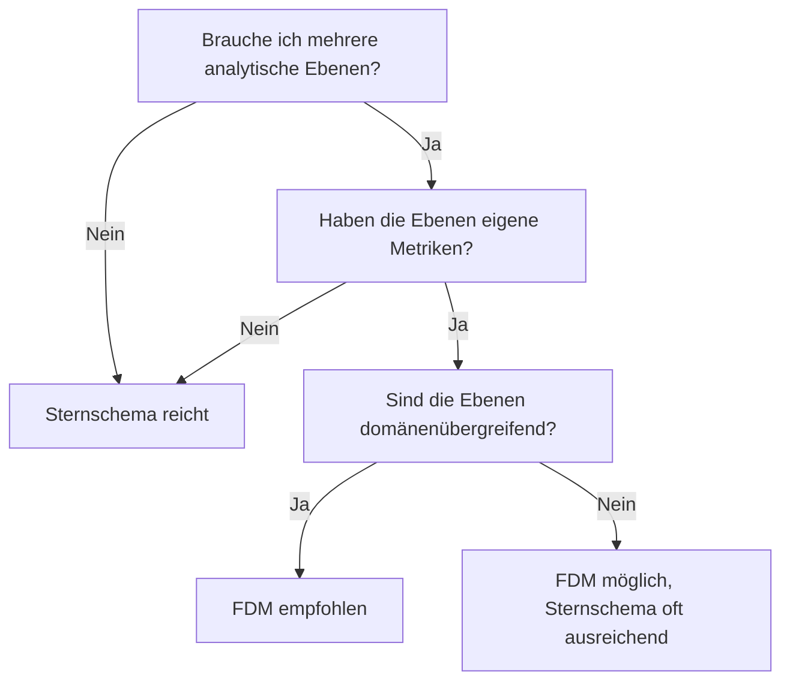

# Einsatzszenarien

#fdm #einsatz

## Geeignet

### Data Mesh
FDM bildet die natürliche Datenstruktur für domänengetriebene Architekturen. Jede Domäne besitzt ihre Sub-Facts, das zentrale Schema verbindet sie. Siehe [[Governance#Integration mit Data Mesh|Data Mesh Integration]].

### Komplexe Kundenanalysen
Customer 360 mit mehreren analytischen Ebenen: Transaktionen → Verhalten → Engagement → Lifetime Value. Jede Ebene als eigener Sub-Fact mit eigener Granularität.

### Mehrstufige Wertschöpfungsketten
Supply Chain, Manufacturing, Logistics — überall wo Fakten auf verschiedenen Aggregationsebenen entlang einer Kette entstehen.

### Multi-Entity-Analysen
Szenarien mit verknüpften Entitäten (Kunde → Vertrag → Schadenfall → Leistung), die jeweils eigene Metriken tragen.

## Nicht geeignet

### Einfache Dashboards
Ein einzelnes Sternschema reicht. FDM-Overhead (Depth-Limit-Management, Sub-Fact-Governance) ist nicht gerechtfertigt.

### Statische Reports
Feste Abfragen auf stabilen Datenstrukturen brauchen keine rekursive Flexibilität.

### OLTP-nahe Szenarien
FDM ist ein analytisches Modell. Für transaktionale Workloads ist es nicht konzipiert.

## Entscheidungshilfe

## Weiterführend

- [[Zielsetzung]] — wofür FDM gedacht ist
- [[Abgrenzung Data Vault]] — wann Data Vault besser passt
- [[Abgrenzung Activity Schema]] — wann Activity Schema besser passt
