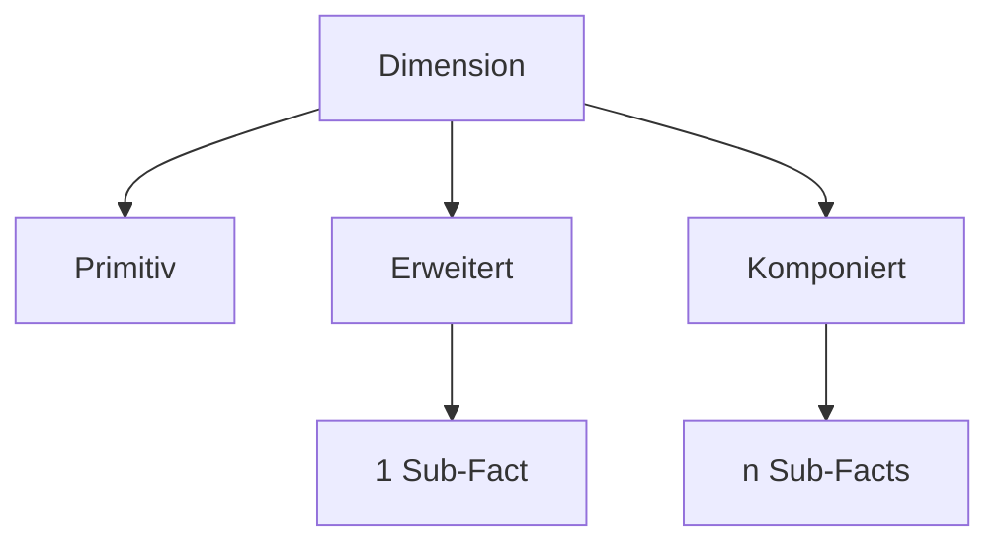

# Dimensionstypen

#fdm #konzept #dimensionen

Die Typisierung von Dimensionen ergibt sich direkt aus der [[Formales Metamodell#Fraktale Relation|fraktalen Relation]] `subFact`.

## Primitive Dimension

$$\text{subFacts}(d) = \emptyset$$

Keine Substruktur. Entspricht einer klassischen Sternschema-Dimension.

**Beispiel:** `dim_date`, `dim_currency`

## Erweiterte Dimension

$$|\text{subFacts}(d)| = 1$$

Enthält genau einen Sub-Fact. Die Dimension dient als Brücke zu einer tieferen analytischen Ebene.

**Beispiel:** `dim_customer` → `fact_customer_behavior`

## Komponierte Dimension

$$|\text{subFacts}(d)| > 1$$

Aggregiert **mehrere** Sub-Facts. Dies ist die ausdrucksstärkste, aber auch komplexeste Variante.

**Beispiel:** `dim_product` → `fact_product_reviews` + `fact_product_returns`

> **Hinweis:** Komponierte Dimensionen erfordern besondere Aufmerksamkeit bei der [[Strukturregeln#Aggregierbarkeit|Aggregierbarkeit]], da mehrere Sub-Facts unterschiedliche Granularitäten haben können.

## Übersicht

## Weiterführend

- [[Strukturregeln]] — Constraints pro Typ
- [[Operatoren]] — Expansion und Join über Typen
- [[Physisches Design]] — Abbildung auf Tabellen
