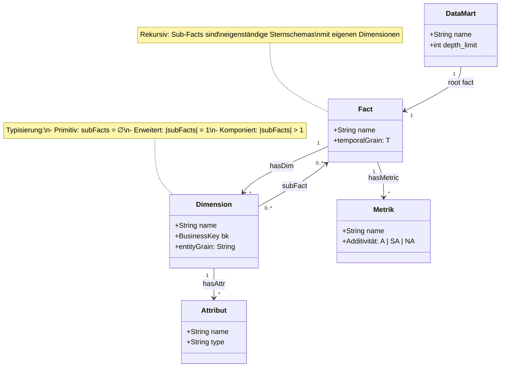
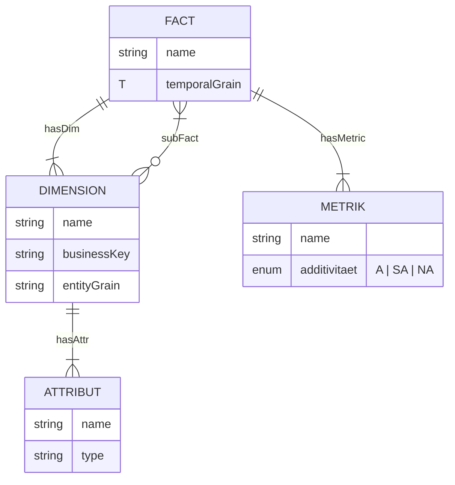
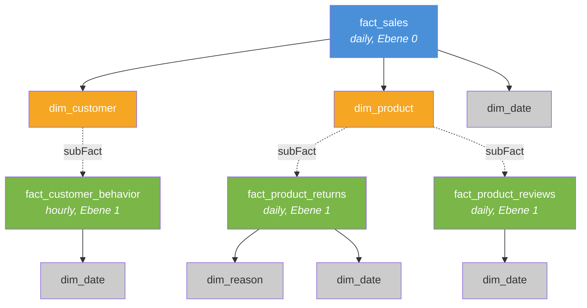

# Formales Metamodell

#fdm #konzept #metamodell

Das Metamodell definiert die mathematische Grundlage des FDM. Es formalisiert die Beziehungen zwischen Fakten, Dimensionen, Metriken und Attributen.

## UML-Klassendiagramm



### Relationen-Übersicht



### Beispiel: Sales-Mart (fraktale Struktur)



> **Legende:** 🔵 Fakten Ebene 0 · 🟢 Sub-Facts Ebene 1 · 🟠 Erweiterte/Komponierte Dimensionen · ⚪ Primitive Dimensionen · Gestrichelte Linien = `subFact`-Relation

## Grundmengen

| Symbol | Bedeutung |
|--------|-----------|
| $F$ | Menge der Faktentypen |
| $D$ | Menge der Dimensionstypen |
| $M$ | Menge der Metriken |
| $A$ | Menge der Attribute |
| $T$ | Temporale Granularitäten: $\{\text{realtime} < \text{hourly} < \text{daily} < \text{weekly} < \text{monthly}\}$ (total geordnet) |
| $J$ | Join-Strategien: $\{\text{latest}, \text{point-in-time}, \text{aggregate}, \text{range}\}$ |

## Relationen

$$\text{hasDim} \subseteq F \times D$$
$$\text{hasAttr} \subseteq D \times A$$
$$\text{hasMetric} \subseteq F \times M$$
$$\text{subFact} \subseteq D \times F$$
$$\text{temporalGrain}: F \to T$$
$$\text{temporalJoin}: D \times F \to J$$
$$\text{joinType}: D \times F \to \{1{:}1,\; 1{:}N\}$$

## Hilfsfunktionen

$$\text{dims}(f) = \{d \mid (f, d) \in \text{hasDim}\}$$
$$\text{subFacts}(d) = \{f \mid (d, f) \in \text{subFact}\}$$
$$\text{metrics}(f) = \{m \mid (f, m) \in \text{hasMetric}\}$$

## Fraktale Relation

Die zentrale Erweiterung gegenüber klassischen Sternschemas:

$$\text{subFact} \subseteq D \times F$$

`subFact` ist eine **Relation**, keine Funktion. Jede Dimension kann **null, einen oder mehrere** Fakten referenzieren. Dies ermöglicht sowohl einfache (erweiterte) als auch [[Dimensionstypen#Komponierte Dimension|komponierte Dimensionen]].

## Rekursive Definition eines Data Mart

Ein Data Mart ergibt sich rekursiv als:

$$\text{Mart}(f, k) = \begin{cases} \{f\} \cup \text{dims}(f) & \text{wenn } k = 0 \\ \{f\} \cup \text{dims}(f) \cup \displaystyle\bigcup_{d \in \text{dims}(f)} \bigcup_{f' \in \text{subFacts}(d)} \text{Mart}(f', k-1) & \text{wenn } k > 0 \end{cases}$$

Der Aufruf erfolgt mit dem [[Strukturregeln#Depth-Limit|Depth-Limit]]:

$$\text{Mart}(f) = \text{Mart}(f, n_{\max})$$

**Base Case:** Bei $k = 0$ oder wenn $\text{subFacts}(d) = \emptyset$ für alle $d$, terminiert die Rekursion.

## Temporale Semantik

Jeder Fakt besitzt eine explizite zeitliche Granularität über $\text{temporalGrain}: F \to T$.

Die Menge $T$ ist **total geordnet**: $\text{realtime} < \text{hourly} < \text{daily} < \text{weekly} < \text{monthly}$.

> **Hinweis:** `snapshot` (z.B. Kontostand zu einem Stichtag) ist keine temporale Granularität, sondern eine **Materialisierungsstrategie**. Snapshot-Fakten erhalten die Granularität ihres Erfassungsrhythmus (z.B. `daily` für tägliche Snapshots).

### Temporaler Join

Wenn Sub-Facts eine **feinere** zeitliche Granularität haben als ihr übergeordneter Fakt, entsteht ein temporales Mismatch. Die Join-Strategie wird über $\text{temporalJoin}: D \times F \to J$ gesteuert:

| Strategie | Beschreibung | Anwendung |
|-----------|-------------|-----------|
| **latest** | Letzter Sub-Fact-Eintrag vor dem Fakt-Zeitstempel | Default. Einfach, performant |
| **point-in-time** | Exakter Zustand zum Fakt-Zeitpunkt | Wenn Sub-Fact sich über die Zeit ändert (z.B. Kundensegment) |
| **aggregate** | Aggregation des Sub-Facts über die Periode des übergeordneten Fakts | Wenn Sub-Fact-Metriken zusammengefasst werden sollen |
| **range** | Alle Sub-Fact-Einträge innerhalb eines Zeitfensters um den Fakt-Zeitstempel | Für Korrelationsanalysen |

### Kompatibilitätsregel

$$\text{temporalGrain}(f') \leq \text{temporalGrain}(f) \quad \text{für alle } f' \in \text{subFacts}(d),\; d \in \text{dims}(f)$$

Ein Sub-Fact darf **nicht gröber** granular sein als sein übergeordneter Fakt. Ein `fact_monthly_summary` darf keinen Sub-Fact `fact_quarterly_revenue` tragen.

### Beispiel

```
fact_sales (daily)
  └── dim_customer
        └── fact_customer_behavior (hourly)
              temporalJoin: aggregate
              → visits und conversions werden pro Tag aggregiert
```

## Schlüsselkonzept

- Jede Dimension besitzt einen **Business Key** (BK)
- Sub-Facts referenzieren den BK ihrer übergeordneten Dimension
- Dies garantiert referenzielle Integrität über Rekursionsebenen hinweg
- Jeder Fakt deklariert seine `temporalGrain` — der temporale Join wird explizit konfiguriert
- Metrik-Metadaten (Additivitätsklassifikation) werden in der [[Governance#Schema Registry|Schema Registry]] gepflegt, nicht im physischen Schema

## Weiterführend

- [[Strukturregeln]] — Invarianten, die das Metamodell einschränken
- [[Dimensionstypen]] — Klassifikation basierend auf `subFact`
- [[Operatoren]] — Operationen auf der Mart-Struktur
- [[Zielsetzung]] — Motivation und Kontext
